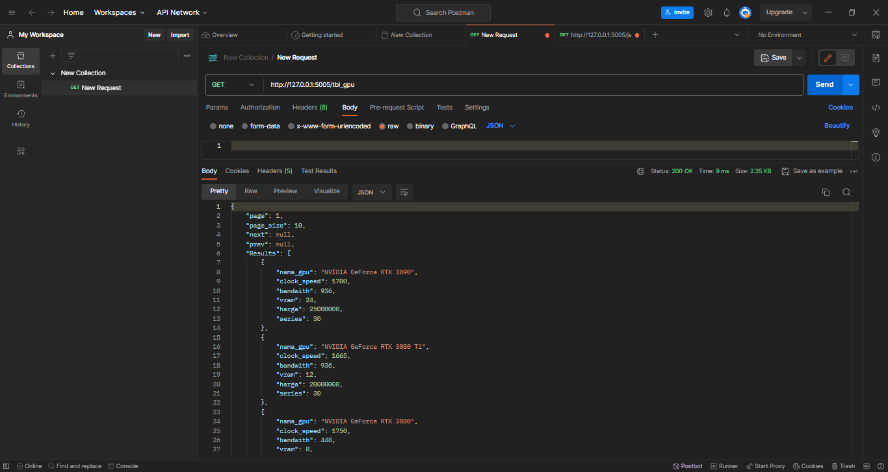

# spk_web
## Install, create and activate virtualenv
https://medium.com/analytics-vidhya/virtual-environment-6ad5d9b6af59

## Install requirements

    pip install -r requirements.txt

## Run the app
to run the web app simply  use

    python main.py

## Usage
Install postman 
https://www.postman.com/downloads/

get GPU list

get saw

get wp

ref:
https://en.wikipedia.org/wiki/Pearson_correlation_coefficient

### TUGAS UAS
Implementasikan model yang sudah anda buat ke dalam web api dengan http method `POST`, contoh implemantasinya dapat dilihat pada repositori ini untuk api recommendation, 

contoh body request (bobot) :

    {
		"clock_speed": 4, 
		"bandwith": 4, 
		"vram": 3, 
		"harga": 5, 
		"series": 3
		}

post saw

get wp

